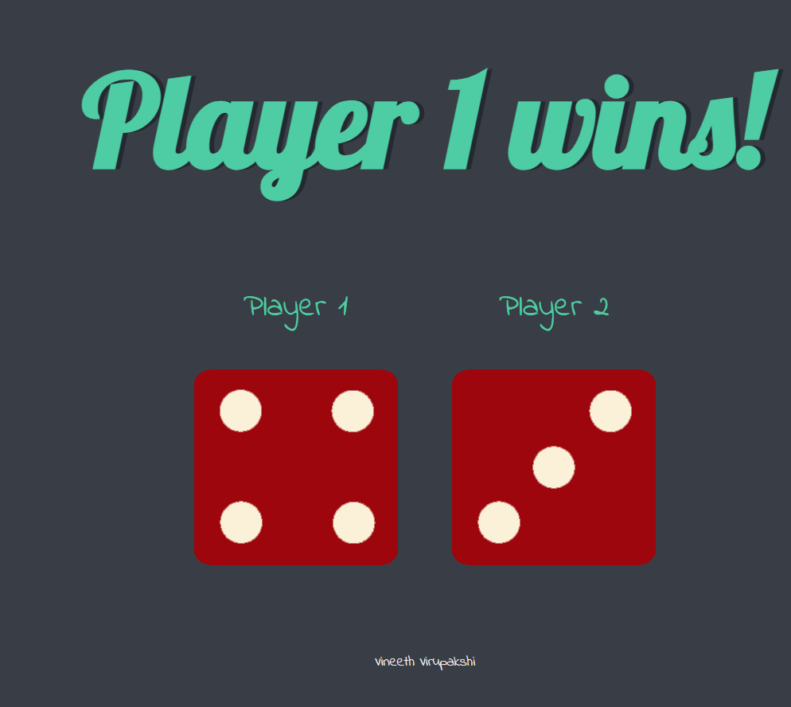

### I basically want to use this Readme file for this folder(Dice Game) is to explain what concepts I learnt or covered in buinding this Dice game and how I implemented those concepts and where to achieve what. I am trying to showcase my understanding of concepts and with an intention to help someone who want to benefit from this project, by sharing this step by step and simple explanation.

## Topics covered in building this Dice Game

1. DOM Manipulation
2. SetAttribute() (JS method)
3. innerHTML concept
4. creation of external JS file 
5. creation of random number using (Math.random())
6. queryselector()
7. Also HTML and CSS format writings 

## The output screenshot looks like this

## If you see in "index.js" file, line 7, 22 & 25, we notice we used a similar function but serves different purpose, "querySelectorAll & querySelector", let's understand that

## querySelectorAll vs querySelector

There are two types of querySelectors, that are querySelectorAll and querySelector

querySelectorAll is going to return one element, whereas querySelectorAll, returns as many elements as match the selection attempt, and these are returned to us as a iterable list that we can loop through.

I suggest this youtube video: [Link to the video](https://youtu.be/hHB7v4Za6Eo?si=AIbS4IpnzGgFYIdZ)
This video clearly explained, how this queryselector methods are different from standard things like using getelementbyid, getelementbyclass, getelementbytagname. How these two types in queryselectors, "querySelectorAll & querySelector" are used and how they are differentiated with sharing multiple different cases and explained where to use what and how to apply.

